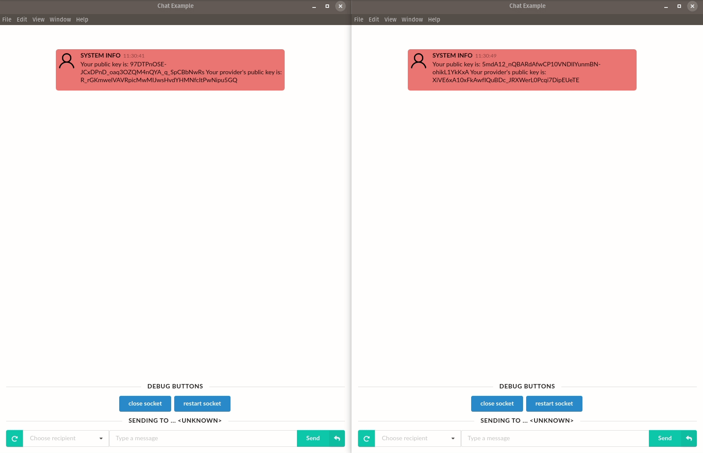

# demo-mixnet-chat-client

**Note: don't depend on this for anything serious, it's a demo rather than a production application.**

This is a simple chat application. You can start a few clients in different console windows, and chat back and forth.  Chat traffic is encrypted and routed through the [nym-mixnet](https://github.com/nymtech/nym-mixnet).

## Requirements

* Go 1.12 or later

## Building it 

From the top-level directory, `make` will build the binary. `./build/chat-client` will show a help screen. 

`./build/chat-client help <command>` will show help text for each subcommand.

## Running it

First, generate keys and configuration files for Alice and Bob.

`./build/chat-client init --id alice`

`./build/chat-client init --id bob`

This will create public/private keypairs and store them on your local machine. If you want to see those, have a look in `~/.loopix` - exact locations are noted upon keypair generation.

`./build/chat-client run --id alice` will start `chat-client` with the generated key info of the user `alice`. 

When it starts, you'll be shown the public key of Alice, and asked which public key you'd like to chat to. 

Next, let's start a chat client for Bob. Fire up a new console window, and run: `./build/chat-client run --id bob`

Again, Bob's client starts up and tells us Bob's public key, and asks what public key you'd like to chat to.

The clients need to get updated presence info from the mixnet, CTRL-C to stop both clients, and then run them again. It's a bit of a hack, but this is the easiest way (for now) to force a refresh of these two newly-registered clients.

For Alice's client, you'll have a window looking like this: 

When you've got both clients running, selecting keys and a simple chat session will look something like this:

Start typing Bob's key (written across the top of his terminal in yellow text) for auto-completion, or use the up and down arrow's to find the Bob client's public key. Then do the same for Alice. You can type `/alias add Bob` and `/alias add Alice` in each Alice and Bob's chat windows, respectively, to provide a slightly nicer chat identifier. 

Although the application looks simple, there's actually quite a bit going on.

Nym mixnet nodes report their presence every few seconds to the Nym directory server, which provides information about Nym mixnet IP addresses and public keys. 

When started in a console, this chat client connects to the Nym directory, and retrieves the current network topology from [https://directory.nymtech.net/api/presence/topology](https://directory.nymtech.net/api/presence/topology).

Once it knows what mixnet nodes exist, the client uses the IP addresses and public keys of Nym mixnet nodes to generate per-packet shared keys for doing [Sphinx](https://cypherpunks.ca/~iang/pubs/Sphinx_Oakland09.pdf) packet encryption. The client immediately begins encrypting dummy traffic, sending loop cover traffic through the mixnet. Loop traffic then loops back to the client, providing cover traffic for both sending and receiving. 

When you type your message into the chat console and hit "enter", the chat client sends your real message instead of a loop cover packet.

## Viewing network traffic

You can view traffic moving across the mixnet by looking at https://dashboard.nymtech.net/. 

On the right hand side, you can see packets sent and received in a 1-second period:

